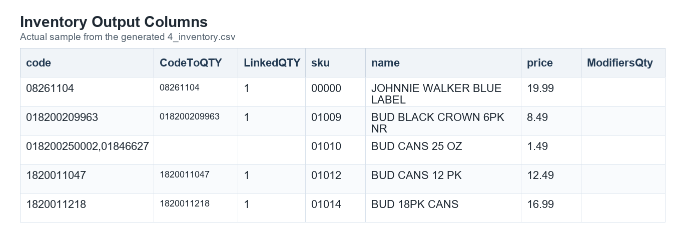
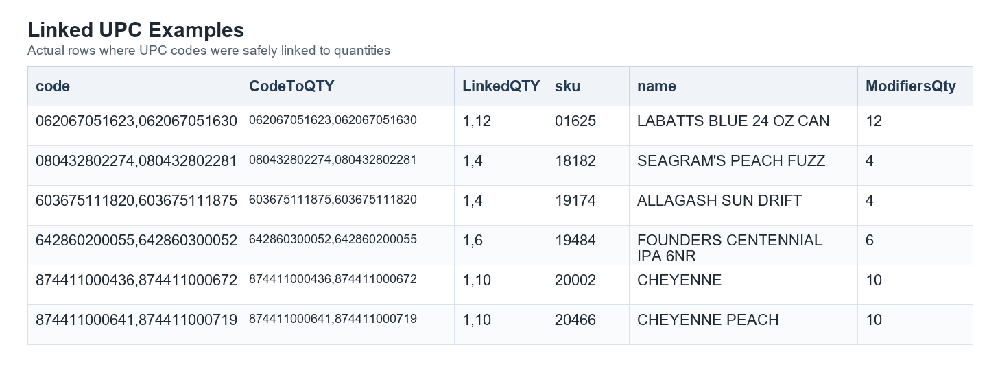
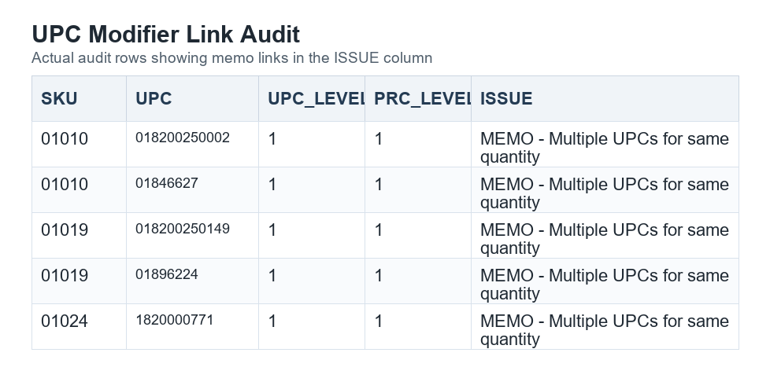

# UPC To QTY Linkage Rules

Version: `7.2.26`  
Date: `2026-07-02`

## Purpose

This document explains how the utility decides whether a UPC code can be linked to a modifier quantity in the inventory export.

The goal is to show clear UPC-to-quantity relationships without changing the existing `code` column behavior.

## Inventory Columns

The utility keeps the current `code` column and adds two columns immediately after it:

| Column | Purpose |
| --- | --- |
| `code` | Existing UPC list. This remains unchanged. |
| `CodeToQTY` | UPC codes that can be safely linked to a quantity. |
| `LinkedQTY` | Quantities linked to the UPC codes in `CodeToQTY`. |

## How To Read The Link

Values in `CodeToQTY` and `LinkedQTY` line up by position.

For example:

| CodeToQTY | LinkedQTY |
| --- | --- |
| `062067051623,062067051630` | `1,12` |

This means:
- `062067051623` links to quantity `1`
- `062067051630` links to quantity `12`

## Linkable UPC Rule

A UPC is linkable only when the utility can prove a one-to-one relationship.

All of these must be true:
- `UPC.DBF.SKU` matches `PRC.DBF.SKU`.
- The UPC is numeric.
- `UPC.DBF.LEVEL` is not blank.
- `UPC.DBF.LEVEL` matches one selected `PRC.DBF.LEVEL`.
- The matched PRC level resolves to one selected `PRC.DBF.QTY`.
- No other UPC for the same SKU links to the same quantity.

When all rules pass, the UPC is added to `CodeToQTY` and the quantity is added to `LinkedQTY`.

## Ordering Rule

Linked values are ordered by quantity, not by UPC code.

This keeps `CodeToQTY` and `LinkedQTY` in a predictable numeric order.

## Duplicate Quantity Rule

If more than one UPC links to the same quantity for one SKU, the utility treats those UPC codes as unlinkable.

This means:
- neither UPC is added to `CodeToQTY`
- the repeated quantity is not added to `LinkedQTY`
- the UPC codes remain in the original `code` column
- the UPC codes are listed in the audit report

This protects the import from guessing when the source data does not identify one clear UPC for one quantity.

## Audit Report Rule

The audit report includes only UPC codes that could not be linked.

The report is named:

`reference_UPCModifierLinkAudit.html`

Common audit reasons include:
- no selected PRC quantity exists for the SKU
- the UPC appears under multiple UPC levels
- the UPC level is blank
- the matching PRC level has more than one quantity
- no selected PRC level matches the UPC level
- multiple UPCs point to the same quantity

The `ISSUE` column opens the row memo. The memo is embedded in the HTML report and explains why the UPC was not added to `CodeToQTY` or `LinkedQTY`.

## Expected Result

The export should be read this way:
- `code` remains the complete UPC list used by the existing import process.
- `CodeToQTY` shows only UPC codes with a safe quantity link.
- `LinkedQTY` shows the matching quantities in the same order.
- The audit report explains UPC codes that were not safe to link.
